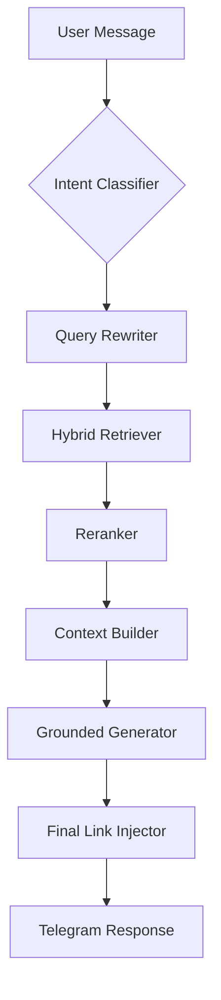

# System Architecture: Lorin RAG V2

## 🧬 The 9-Stage Orchestration Pipeline
Lorin operates on a "Reason-Before-Search" model. Instead of a naive retrieval, the `orchestrator.ts` executes the following logic chain:

1. **Classification**: `classifyIntent` maps queries to specific institutional domains (Admission/Placement/etc).
2. **Contextual Expansion**: `rewriteQuery` resolves pronouns by analyzing the last 3 messages in history.
3. **Retrieval**: `hybridRetrieve` performs a 1536-dimensional vector search on Qdrant and an ILIKE keyword search on Supabase.
4. **Deduplication**: Merges vector and keyword results while preserving source metadata.
5. **Reranking**: A small-model reranker scores the top 10 chunks to move the most factually dense data to the top.
6. **Agent Decision**: `agentDecide` determines if the bot should show an admission form or ask a clarifying question.
7. **Context Assembly**: Combines user profile, short-term memory, and retrieved campus data.
8. **Generation**: `generateGrounded` instructs the LLM to strictly adhere to the provided context with specific formatting rules (no bolding, emoji support).
9. **Post-Processing**: `postProcess` performs the final link injection, mapping source files to their official `.php` URLs.

## 🗄️ Knowledge Infrastructure
- **Structural Scraping**: We target `<table>` and `<li>` elements specifically to capture faculty roles and seat counts often lost by LLM-based crawlers.
- **Narrative Merge**: We use Trafilatura to capture the "vibe" and descriptive text of the college departments.
- **Master Files**: All data is merged into `03_master` files before being chunked into 1000-character segments to maximize the Signal-to-Noise Ratio (SNR).

## 📊 Logic Flow

